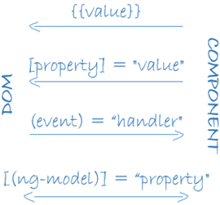
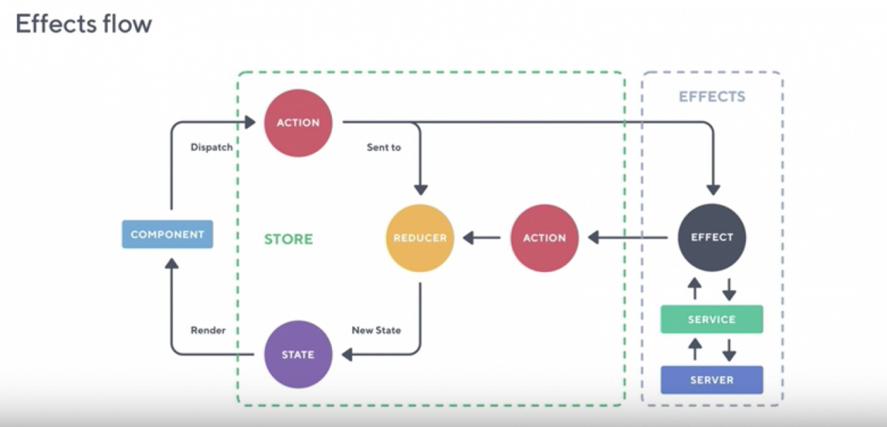

## Angular


[Дмитрий Вайнер](https://github.com/dmitryweiner)

---

### Фишечки
* TypeScript из коробки.
* Удобная автогенерация кода.
* Иерархия компонентов заложена в дизайне.
* Ленивая загрузка модулей и компонентов.
* Есть роутер.
* Есть сервисы (аналог стора).
* Есть собственный [твитор](https://twitter.com/angular).
---

### Установка
* Если есть права админа:
```shell
npm install -g @angular/cli
```
* Создание проекта:
```shell
ng new %APP_NAME%
```
* Если нет прав админа:
```shell
npx -p @angular/cli ng new %APP_NAME%
```
---

### Запуск
```shell
ng serve --open
```


---

### CLI
* Через CLI можно делать многие полезные вещи:
  * generate: сгенерировать что-то.
  * build: собрать проект.
  * add: добавить библиотеку.
  * test: юнит-тесты.
  * e2e: тест приложения в сборе.
  * lint: линтер.
* [Полный список](https://angular.io/cli).
---

### Идеология
* Приложение строится из модулей.
* Должен быть один корневой модуль и фиче-модули.
* Модуль содержит вью для отображения компонентов.
* Модуль использует сервисы (подключаются через инъекцию зависимостей).
* Модули используют декораторы.
---

### Автогенерация модуля
ng generate module chat
---

### Структура модуля
* Компонент(ы).
* Шаблон компонента.
* CSS компонента.
* Тест компонента.
* Модуль.


---

### Что внутри модуля
```js
import { NgModule } from '@angular/core';
import { BrowserModule } from '@angular/platform-browser';
@NgModule({
  imports:      [ BrowserModule ],
  providers:    [ Logger ],
  declarations: [ AppComponent ],
  exports:      [ AppComponent ],
  bootstrap:    [ AppComponent ]
})
export class AppModule { }
```
---

### Что внутри модуля
* declarations: перечисление компонентов и директив модуля.
* exports: что экспортируется наружу.
* imports: что импортируется в этот модуль.
* providers: какие сервисы есть в этом модуле.
* bootstrap: главное вью модуля.
---

### Особые модули
* BrowserModule импортируется один раз в корневом модуле.
* CommonModule импортируется в фиче-модулях.
  * Это нужно для работы директив ngIf, ngFor.
---


---

### Компоненты
* Компонент лежит внутри модуля и что-то отображает.
* Модуль может содержать несколько компонентов.
* Компоненты могут переиспользовать компоненты из других модули (части UI).
---

### Автогенерация компонента
```shell
ng generate component %MODULE_NAME%/%COMPONENT_NAME%
```
---

### Структура компонента

```js
import { Component } from '@angular/core';

@Component({
  selector: 'app-root', // тег компонента: <app-root></app-root>
  templateUrl: './app.component.html',
  styleUrls: ['./app.component.css']
})
export class AppComponent {
  title = 'angular-test'; // стейт
  methodName() {} // метод
}
```
---
### Передача данных из одного компонента в другой
```angular2html
<component [property]="value"></component>
```
---

### Синтаксис шаблонов
* [Подробнее](https://angular.io/guide/template-syntax).
* Вывод переменных и выражений JS:
```angular2html
<span>{{ title }} app is running!</span>

```
* Обработчик событий:
```angular2html
<button (click)="callPhone()">Call</button>
```
* Активный атрибут:
```angular2html
<div [hidden]="!itemForm.form.valid"></div>
```
* [Переменная шаблона](https://angular.io/guide/template-reference-variables):
```angular2html
<input #phone placeholder="phone number" />
{{ phone.value }}
```
---

### Pipes
```angular2html
<!-- Default format: output 'Jun 15, 2015'-->
 <p>Today is {{today | date}}</p>

<!-- fullDate format: output 'Monday, June 15, 2015'-->
<p>The date is {{today | date:'fullDate'}}</p>

<!-- shortTime format: output '9:43 AM'-->
<p>The time is {{today | date:'shortTime'}}</p>
```
* [Какие бывают потоки](https://angular.io/api?type=pipe).
---

### Директивы шаблонов
* [ngIf](https://angular.io/api/common/NgIf): отображает HTML, если выражение true:
```angular2html
<div *ngIf="condition">Content to render when condition is true.</div>
```
* [ngFor](https://angular.io/api/common/NgForOf): итерация по массиву:
```angular2html
<li *ngFor="let item of items">{{item.title}}</li>
```
* [ngSwitch](https://angular.io/api/common/NgSwitch): switch/case:
```angular2html
<container-element [ngSwitch]="switch_expression">
   <some-element *ngSwitchCase="match_expression_1">...</some-element>
   <some-element *ngSwitchCase="match_expression_2">...</some-element>
   <some-element *ngSwitchDefault>...</some-element>
</container-element>
```
* ngModel: двустороннее связывание.
* [Список директив](https://angular.io/guide/built-in-directives).
---

### Двусторонний биндинг


---

### Двусторонний биндинг
* Ставим библиотеку ```@angular/forms```.
* В модуле:
```js
import { FormsModule } from '@angular/forms';
imports: [ /* тут остальные импорты */
    FormsModule
],
```
* В компоненте:
```js
export class Component {
    value = 'Всем приветы';
}
```
* В шаблоне:
```angular2html
<input type="text" [(ngModel)]="value">
```
---

### Формы
* Поля формы могут быть привязаны к полям объекта.
* https://metanit.com/web/angular2/5.1.php
---

### Валидация
https://metanit.com/web/angular2/5.3.php
---

### Стили компонентов
https://angular.io/guide/component-styles
---

### Сервисы
```shell
ng generate service %SERVICE_NAME%
```
---

### Сервисы и DI
https://metanit.com/web/angular2/4.3.php
---

### Слушатели сервисов
---

### Роуты
```shell
ng generate module app-routing --flat --module=app
```
---

### Менеджеры состояний

https://ngrx.io/guide/store
https://medium.com/angular-in-depth/handle-api-call-state-nicely-445ab37cc9f8
https://github.com/zhaosiyang/loadable-example/tree/e505183bd25d55c173be03ad3ea43f019a373c50
---

---

### Маршрутизация в сторе
Можно использовать @ngrx/router-store
Подключить routerReducer
Добавить вызов RouterStoreModule.connectRoute в основном модуле приложения
Добавляем RouterState в основное состояние приложения
https://habr.com/ru/post/425959/
---

### Полезные ссылки
* https://metanit.com/web/angular2/
* https://angular.io/guide/
* https://habr.com/ru/post/348818/