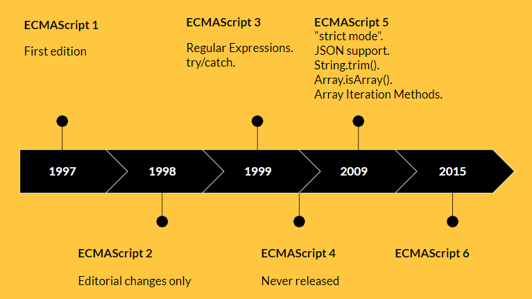
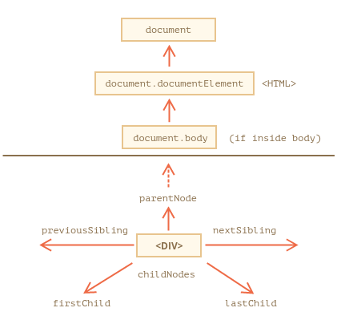

### Введение в JavaScript


[Дмитрий Вайнер](https://github.com/dmitryweiner)
---

### Факты
* Создатель [Брендан Айк (Brendan Eich)](https://twitter.com/brendaneich?lang=en).
* Год создания: 1995.
* Текущая версия: [12th Edition – ECMAScript 2021](https://en.wikipedia.org/wiki/ECMAScript#12th_Edition_%E2%80%93_ECMAScript_2021).
---

### Основные принципы
* Нестрогая типизация.
* Низкий порог входа.
* Выполняется в браузере (уже не только).
* Выполняется интерпретатором без компиляции.
* Прощает ошибки программиста (додумывает что-то своё).
---

### История развития языка

---

### История развития языка

---

### История развития фреймворков на JS

---

### История развития фреймворков на JS

---

### Объявление переменных
* Устаревший синтаксис:
```js
var i = 1;
```
* Современный синтаксис:
```js
let i;
const j = 2;
```
* За один раз можно объявить и инициализировать несколько переменных:
```js
const i = 1, j = 2;
```
---

### Чем плох var?
* Объявление переменной перемещается в начало блока (hoisting).
* Нет блочной области видимости.
* Нет ошибки при повторном объявлении.
* При объявлении в глобальной области видимости затрагивает объект window. 
* [Подробнее](https://learn.javascript.ru/var). 
---

### Разница между let и const
* **const** служит для переменных, чьё значение не будет изменяться:
```js
const a = 1;
a = 2; // Exception!
const arr = [1, 2, 3];
arr.push(4); // всё хорошо, ссылка на массив не изменилась
```
* **let** для тех переменных, которые изменяются:
```js
let i = 1;
i = 2; // всё в порядке
```
---

### Области видимости
* Переменная видна только после объявления.
```js
console.log(i); // Uncaught ReferenceError: i is not defined
const i = 1;
console.log(i); // 1
```
* Переменная, объявленная внутри блока, видна только внутри этого блока.
```js
{
    const i = 1;
}
console.log(i); // Uncaught ReferenceError: i is not defined
```
---

### Области видимости
* Внутри блока видны внешние переменные сколь угодного высоких уровней.
```js
const i = 1;
{
    console.log(i); // 1
}
```
* Блочные переменные перекрывают внешние при совпадении имён.
```js
const i = 1;
{
    const i = 2;
    console.log(i); // 2
}
```
---

### Типы данных
* **number**: число.

```js
const i = 1; // в десятиричном виде
const j = 0xBE; // в 16-ричном виде
const k = 0777; // в восьмеричном виде
const f = 0b0101010; // в двоичном виде
```
* **string**: строка.

```js
const s = "string";
const anotherString = '123';
const phrase = `Обратные кавычки позволяют
 встраивать переменные ${s}`; // шаблонная строка
```
* **boolean**: [булево](https://ru.wikipedia.org/wiki/%D0%91%D1%83%D0%BB%D1%8C,_%D0%94%D0%B6%D0%BE%D1%80%D0%B4%D0%B6) значение.

```js
const isSet = true;
```
---

### Типы данных
* **function**: функция.

```js
const f = function (i) {
    return i * 2;
};
```
* **array**: массив.

```js
const arr = [1, 2, 3];
```
* **object**: объект.

```js
const obj = {
    field: 1
};
```
---

### Специальные типы
* **undefined**: не определено.

```js
let u;
console.log(u); // undefined
```
* **null**: значение неизвестно.

```js
let u = null;
console.log(u); // null
```
---

### Как узнать тип прямо в коде
* Оператор **typeof**:

```js
typeof undefined // "undefined"
typeof 0 // "number"
typeof 10n // "bigint"
typeof true // "boolean"
typeof "foo" // "string"
typeof null // "object" -- известный баг
typeof alert // "function"
```
---

### Операторы
* Присваивание: =
* Математические: *, /, +, -, %, **, ++, --
* Сравнения: >, <, >=, <=, ==, !=, ===, !==
* Логические: !, ||, &&
* Тернарный: ?
* Побитовые: |, &, ~, ^, <<, >>, >>>
* [Подробнее](https://learn.javascript.ru/operators).

---

### Неявное приведение типа
* Операторы неявно приводят переменные к тому типу, с которым работают.
* Математические операторы приводят к типу number, кроме оператора +.
* Логические операторы и операторы сравнения приводят к типу boolean.
* [Подробнее](https://learn.javascript.ru/type-conversions).
```js
"6" / "2" // 3
3 + "2" // 5
```
---

### Особенности оператора +
* Оператор "+" работает ещё и со строками, поэтому если первый операнд строка, то второй будет преобразован в строку:

```js
'2' + 1
// '21'

'2' - 1
// 1
```
---

### Явное приведение типа
* Если есть сомнения относительно типа пришедших данных, можно преобразовать к нужному типу:

```js
let value = "123";
console.log(value + 1); // "1231"
console.log(Number(value) + 1); // "124"
```
* Преобразовывать можно в любой встроенный тип: String, Number, Boolean, Array:

```js
String(123) // "123"
Boolean("false") // false
Number("123") // 123
```
* [Подробнее](https://learn.javascript.ru/type-conversions).
---

### Странности JS
* Поскольку преобразование типов может происходить неявно, некоторый код
  [выполняется странно](https://github.com/denysdovhan/wtfjs).
* Чтобы так не было, код надо писать с учётом типов или пользоваться типизированным языком TypeScript.
---

### Сравнение с учётом типа
* Есть два оператора сравнения: == и ===.
* Оператор == сравнивает, приводя операнды к типу первого:
```js
1 == "1" // true
```
* Оператор === сравнивает ещё и типы операндов. Если они не равны, равенство неверно:
```js
1 === "1" // false
```
* Надо пользоваться **ТОЛЬКО** операторами **===** и **!==**.
---

### Массивы
* Массивы объявляются с помощью квадратных скобок.
* Нумерация индексов элементов начинается с 0.
* Можно добавлять/удалять элементы в любой момент.
* Длина массива хранится в свойстве .length.
```js
const a = [], arr = [1, 2, 3];
arr.length; // 3
arr.push(4); // [1, 2, 3, 4]
arr.length; // 4
arr[0]; // 1
```
---

### Массивы
* Из массива можно вырезать кусок произвольной длины из произвольного места с помощью _splice_.
  **Внимание!** Этот метод меняет сам массив.
```js
const arr = [1, 2, 3, 4, 5];
arr.splice(1, 2);
console.log(arr); // [1, 4, 5]
```
* Можно взять часть массива с помощью _slice_. Этот метод массив не изменяет.
```js
const arr = [1, 2, 3, 4, 5];
console.log(arr.slice(1, 2)); // [2, 3]
console.log(arr); // [1, 2, 3, 4, 5]
```
* [Подробнее](https://learn.javascript.ru/array-methods).
---

### Объекты
* Объект создаётся с помощью фигурных скобок, в которых перечисляются поля и значения.
* В объект можно добавить поле после создания.
* Значение поля можно посмотреть с помощью оператора точка "."
```js
const obj = {
    field: 1,
    stringField: "123",
    method() { /* ... */ }
};
obj.anotherField = true;
console.log(obj.field); // 1
```
---

### Создание объекта
* При создании объекта можно использовать другие переменные в качестве полей:
```js
const str = "123";
const field1 = "123";
const field2 = "456";
// ❌
const obj = {
    name: str,
    field1: field1,
    field2: field2
};
// ✔
const obj = {
    name: str,
    field1,
    field2
};
```
---

### Optional chaining
* Что если мы пытаемся получить доступ к полю объекта,
  а такого поля нет?
```js
const obj = {
    a: 1,
    b: 2
};
console.log(obj.c.d); // Error!
console.log(obj?.c?.d); // undefined
```
* [Подробнее](https://learn.javascript.ru/optional-chaining).

---

### Ссылочные типы данных
* Присваивание переменных, содержащих массивы или объекты, происходит по ссылке:

```js
const obj = { a: 1, b: 2};
const anotherObj = obj;
anotherObj.b = 42;
console.log(obj.b); // 42

const arr = [1, 2, 3];
const anotherArr = arr;
anotherArr[1] = 123;
console.log(arr[1]); // 123
```
----


---

### Условия
* Условный оператор if / else обрамляется фигурными скобками. 
* В условии должно быть булево значение или выражение, возвращающее такое значение.
* Если в условии не булево значение, оно будет к нему приведено.
```js
const a = 1, b = 2;
if (a > b) {
    console.log("a больше b");
} else {
    console.log("a не больше b");
}
```
---

### Switch
* Если if'ов много, удобно сделать из них switch:
```js
switch (a) {
    case 1: 
        console.log("a === 1");
        break;
    case 2: 
        console.log("a === 2");
        break;
    case 3: 
        console.log("a === 3");
        break;
    default: console.log("ни одно условие не сработало");
}
```
---

### Циклы
* Циклы делаются с помощью конструкций while, do/while, for:

```js
let i = 0;
while(i < 5) {
    console.log(i);
    i++;
}

// переменная объявляется прямо в for
for (let j = 0; j < 5; j++) {
    console.log(j);
}
```

---

### Варианты for
* Помимо классического for'а с переменной цикла есть ещё 2 удобных варианта для походов по массивам:

```js
const arr = [1, 2, 3];

// итерируем по индексам массива
for (let i in arr) {
    console.log(arr[i]);
}

// итерируем по элементам массива
for (let item of arr) {
  console.log(item);
}
```
---

### Функции
* Функция &mdash; участок кода, который можно вызвать.
* Функции бывают анонимные и именованные.
* Функции могут принимать на вход аргументы.
* Функции могут возвращать значение (return).
* Ссылку на функцию можно сохранить в переменную и потом вызвать.
* Функция может вызывать саму себя (рекурсия).
---

### Функции
[Документация](https://learn.javascript.ru/es-function).

```js
function fact(number) {
    let result = 1;
    for (let i = 1; i <= number; i++) {
        // сокращённая запись result = result * number
        result *= i;
    }
    return result;
}
fact(5); // 120
```
---

### Варианты анонимных функций
* Анонимная функция может быть записана в полном виде:
```js
const multiply = function (a, b) {
    return a * b;
}
multiply(2, 2); // 4
```
* Или в стрелочном виде:
```js
const divide = (a, b) => {
    return a / b;
}
divide(4, 2); // 2
```
---

### Варианты стрелочных функций
* Если стрелочная функция сразу возвращает результат, можно обойтись без {}.
* Если аргумент один, можно обойтись без ().

```js
// эти функции эквивалентны
const square = function (a) {
    return a * a;
}

const square = (a) => {
    return a * a;
}

const square = a => a * a;
```
---

### Параметры по умолчанию
* У функции могут быть параметры, которые можно не указывать. Тогда будут заданы значения по умолчанию:
```js
function sayMyName(name = "Walter White") {
    console.log(`Your name is ${name}`);
}
sayMyName("Dmitry"); // Your name is Dmitry
sayMyName(); // Your name is Walter White
```
* Параметры по умолчанию могут быть не только значением, но и выражением.
* Они должны быть последними в списке параметров. Так нельзя: ❌
```js
function sayMyName(firstName = "Walter", lastName) {}
```
---

### Ссылочные типы в параметрах
* При передаче ссылочных типов в аргументах функция может их изменять.
* Эти изменения будут видны снаружи функции.
* Нельзя использовать этот эффект для возврата значений из функции, следует пользоваться return'ом.
```js
function changer(o) {
    o.a = 123;
}
const obj = { a: 1, b: 2};
changer(o);
console.log(obj.a); // 123
```
---

### Rest & spread
* Оператор ...rest используется в аргументах функции и вбирает в себя все не перечисленные параметры.

```js
function sumAll(...args) { // args — имя массива
  let sum = 0;
  for (let arg of args) sum += arg;
  return sum;
}
console.log(sumAll(1, 2, 3)); // 6
```
* [Подробнее](https://learn.javascript.ru/rest-parameters-spread-operator).
---

### ...rest и аргументы функции
* Не все аргументы могут лежать в ...rest. Могут быть и указанные аргументы:
```js
function sayMyName(firstName, lastName, ...rest) {
    console.log(`${firstName} ${lastName} - ${rest}`);
}
```
---

### Rest & spread
* Оператор ...spread используется там, где ожидается несколько аргументов.
* Ему на вход подаётся что-то итерируемое (объект, массив).
```js
const arr = [1, 2, 3];
console.log(sumAll(...arr)); // 6
```
---

### Копирование объектов и массивов с помощью ...spread
* Чтобы избежать копирования по ссылке, нужно скопировать сам объект/массив.
* В этом нам поможет оператор ...spread:

```js
const obj = { a: 1, b: 2};
const newObj = {...obj};
newObj.a = 123;
console.log(obj.a); // 1

const arr = [1, 2, 3];
const newArr = [...arr];
newArr[1] = 123;
console.log(arr[1]); // 2
```
---

### Деструктурирующее присваивание
* Можно при создании переменных брать значения из объектов:
```js
const obj = { a: 1, b: 2 };
const { a, b } = obj;
console.log(a, b); // 1, 2
```
* Или из массивов:
```js
const arr = [1, 2, 3];
const [a, b] = arr;
console.log(a, b); // 1, 2
```
* [Подробнее](https://learn.javascript.ru/destructuring-assignment).
---

### Деструктурирующее присваивание и ...rest
* Оставшиеся поля можно сложить в одну переменную с помощью оператора ...rest:

```js
const obj = { a: 1, b: 2, c: 3, d: 4 };
const {a, b, ...notUsed} = obj;
console.log(a, b); // 1, 2
console.log(notUsed); // { c: 3, d: 4 }

const arr = [1, 2, 3, 4];
const [f, g, notUsedArray] = arr;
console.log(f, g); // 1, 2
console.log(notUsedArray); // [3, 4]
```
---

### Деструктурирующее присваивание и параметры по умолчанию
* У объекта может не быть указанных полей, поэтому разумно применить параметры по умолчанию:

```js
const user = {
    firstName: "Walter",
    lastName: "White"
};
const { fistName = "", lastName = "", surname = "" } = user; 
```
---

### Деструктурирующее присваивание в аргументах функции
* Можно пользоваться деструктурирующим присваиванием прямо в аргументах функции.
* Это удобно, когда параметров слишком много (больше 3).
* Удобно это сочетать с параметрами по умолчанию.
---

### Деструктурирующее присваивание в аргументах функции
```js
function showMenu({title = "Заголовок", width = 100, height = 200}) {
  console.log(`${title} ${width} ${height}`);
}

// чтобы вызвать совсем без параметров:
function showMenu({
                    title = "Заголовок",
                    width = 100,
                    height = 200
} = {}) {
  console.log(`${title} ${width} ${height}`);
}
```
---

### Обращение к DOM'у
* Поиск элементов DOM осуществляется с помощью следующих методов:
  * document.getElementById().
  * document.querySelector().
  * document.querySelectorAll().
  * document.getElementsByTagName().
  * document.getElementsByClassName().
  * document.getElementsByName().
* [Подробнее](https://learn.javascript.ru/searching-elements-dom).
----

```html
<script>
    const element = document.getElementById("root");
    console.log(element);
</script>
<div id="root"></div>
```
---

### Оси родитель-потомок и другие
* У найденного элемента можно посмотреть его потомков:
  * childNodes.
  * firstChild.
  * lastChild.
* И его родителя:
  * parentNode. 
* [Подробнее](https://learn.javascript.ru/dom-navigation).
----


---

### Коллекции
* Методы поиска по DOM querySelectorAll, getElementsByName и др. возвращают коллекции узлов.
* Коллекции могут быть итерированы с помощью for..of:
```js
for (let node of document.body.childNodes) {
  conslole.log(node); // покажет все узлы из коллекции
}
```
* Коллекцию можно сконвертировать в массив для фильтрации или сортировки:
```js
const arr = Array.from(document.body.childNodes);
```
---

### Живые коллекции
* Коллекции являются живыми (кроме querySelectorAll) и динамически обновляются при изменении DOM.
* Если мы сохраним ссылку на elem.childNodes и добавим/удалим узлы в DOM, то они появятся в сохранённой коллекции автоматически.
---

### Изменение свойств
* У найденных узлов можно читать и изменять всевозможные свойства:
  * .innerText.
  * .innerHTML.
  * .style.
  * .width.
  * .height.
  * .value (только для input).

```html
<script>
    const element = document.getElementById("root");
    element.innerText = "123";
</script>
<div id="root"></div>
```
---

### Обработчики
```html
<script>
    const element = document.getElementById("button");
    element.addEventListener("click", () => {
        console.log("Button clicked!");
    });
</script>
<button id="button">Click me!</button>
```
---

### Обработчик загрузки страницы
```js
document.addEventListener("DOMContentLoaded", () => {
    
});
```
---

### Таймеры
https://learn.javascript.ru/settimeout-setinterval
---

### Замыкания
https://learn.javascript.ru/closure
---

### Промисы
https://learn.javascript.ru/promise
---

### async/await
https://learn.javascript.ru/async-await
---

### Походы в сеть
https://learn.javascript.ru/fetch
---

### Генераторы
https://learn.javascript.ru/generator
---

### Map 
https://learn.javascript.ru/map-set
---

### Set
---

### Массивы: добавление/удаление элементов:
* push(...items) – добавляет элементы в конец,
* pop() – извлекает элемент с конца,
* shift() – извлекает элемент с начала,
* unshift(...items) – добавляет элементы в начало.
* splice(pos, deleteCount, ...items) – начиная с индекса pos, удаляет deleteCount элементов и вставляет items.
---

### Массивы: добавление/удаление элементов:
* slice(start, end) – создаёт новый массив, копируя в него элементы с позиции start до end (не включая end).
* concat(...items) – возвращает новый массив: копирует все члены текущего массива и добавляет к нему items. Если какой-то из items является массивом, тогда берутся его элементы.
---

### Массивы: поиск среди элементов:
* indexOf/lastIndexOf(item, pos) – ищет item, начиная с позиции pos, и возвращает его индекс или -1, если ничего не найдено.
* includes(value) – возвращает true, если в массиве имеется элемент value, в противном случае false.
---

### Массивы: поиск среди элементов:
* filter - для каждого элемента вызывает функцию и отдаёт все те, для которых функция возвращает true.
* find – то же, что и предыдущее, только возвращается первый элемент.
* findIndex похож на find, но возвращает индекс вместо значения.
---

### Массивы: перебор элементов:
* forEach(func) – вызывает func для каждого элемента. Ничего не возвращает.
* map(func) – создаёт новый массив из результатов вызова func для каждого элемента.
* sort(func) – сортирует массив «на месте», а потом возвращает его.
* reverse() – «на месте» меняет порядок следования элементов на противоположный и возвращает изменённый массив.
---

### Массивы: перебор элементов:
* reduce(func, initial) – вычисляет одно значение на основе всего массива, вызывая func для каждого элемента и передавая промежуточный результат между вызовами.

```js
const arr = [1, 2, 3];
arr.reduce(
    (accumulator, currentValue) => accumulator + currentValue,
    0
);
// 6 - сумма массива
```
---

### Массивы: полезные функции:
* split/join – преобразует строку в массив и обратно.
* Array.isArray(arr) проверяет, является ли arr массивом.
* [Документация](https://learn.javascript.ru/array-iteration).
---

### Примеры

```js
const arr = [1, -1, 2, -2, 3];
arr.map(element => element * element);
// возвели в квадрат каждый элемент и вернули массив [1, 1, 4, 4, 9]

arr.forEach(element => console.log(element)); // вывели каждый элемент

arr.reduce((accumulator, currentValue) => accumulator + currentValue);
// 3 - сумма массива

arr.reverse() // перевернутый массив [3, -2, 2, -1, 1]
```
---

### Полезные методы массивов
* every: возвращает true, если вызов callback вернёт true для каждого элемента arr.
* some: возвращает true, если вызов callback вернёт true для какого-нибудь элемента arr.

```js
const arr = [1, -1, 2, -2, 3];

const isPositive = element => element > 0;

arr.every(isPositive); // false, не все положительные
arr.some(isPositive); // true, есть хоть одно положительное
arr.filter(isPositive); // [1, 2, 3]
arr.find(isPositive); // 1 -- первое положительное число
arr.findIndex(isPositive); // 0
```
---

### Полезные ссылки
* https://learn.javascript.ru/
* https://htmlacademy.ru/courses/343
