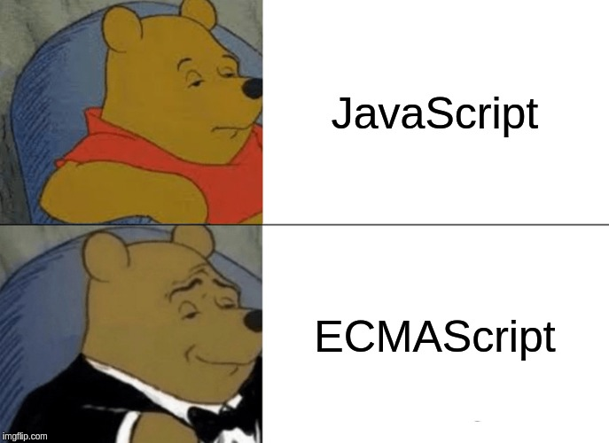
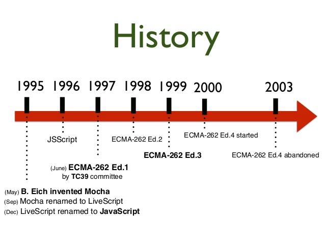

### Введение в JavaScript



[Дмитрий Вайнер](https://github.com/dmitryweiner)
---

### История развития языка

---

### История развития языка

---

### История развития фреймворков на JS

---

### История развития фреймворков на JS

---

### Основные принципы
* Нестрогая типизация.
* Низкий порог входа.
* Выполняется в браузере (уже не только).
* Выполняется интерпретатором без компиляции.
* Прощает ошибки программиста (додумывает что-то своё).
---

### Объявление переменных
* Устаревший синтаксис:
```js
var i = 1;
```
* Современный синтаксис:
```js
let i;
const j = 2;
```
---

### Чем плох var?
* Объявление переменной перемещается в начало блока (hoisting).
* Нет блочной области видимости.
* Нет ошибки при повторном объявлении.
* При объявлении в глобальной области видимости затрагивает объект window. 
* [Подробнее](https://learn.javascript.ru/var). 
---

### Разница между let и const
* **const** служит для переменных, чьё значение не будет изменяться:
```js
const a = 1;
a = 2; // Exception!
const arr = [1, 2, 3];
arr.push(4); // всё хорошо, ссылка на массив не изменилась
```
* **let** для тех переменных, которые изменяются:
```js
let i = 1;
i = 2; // всё в порядке
```
---

### Области видимости
* Переменная видна только после объявления.
```js
console.log(i); // Uncaught ReferenceError: i is not defined
const i = 1;
console.log(i); // 1
```
* Переменная, объявленная внутри блока, видна только внутри этого блока.
```js
{
    const i = 1;
}
console.log(i); // Uncaught ReferenceError: i is not defined
```
---

### Области видимости
* Внутри блока видны внешние переменные сколь угодного высоких уровней.
```js
const i = 1;
{
    console.log(i); // 1
}
```
* Блочные переменные перекрывают внешние при совпадении имён.
```js
const i = 1;
{
    const i = 2;
    console.log(i); // 2
}
```
---

### Типы данных
* **number**: число.

```js
const i = 1; // в десятиричном виде
const j = 0xBE; // в 16-ричном виде
const k = 0777; // в восьмеричном виде
const f = 0b0101010; // в двоичном виде
```
* **string**: строка.

```js
const s = "string";
const anotherString = '123';
const phrase = `Обратные кавычки позволяют
 встраивать переменные ${s}`; // шаблонная строка
```
* **boolean**: [булево](https://ru.wikipedia.org/wiki/%D0%91%D1%83%D0%BB%D1%8C,_%D0%94%D0%B6%D0%BE%D1%80%D0%B4%D0%B6) значение.

```js
const isSet = true;
```
---

### Типы данных
* **function**: функция.

```js
const f = function (i) {
    return i * 2;
};
```
* **object**: объект.

```js
const obj = {
    field: 1
};
```
---

### Специальные типы
* **undefined**: не определено.

```js
let u;
console.log(u); // undefined
```
* **null**: значение неизвестно.

```js
let u = null;
console.log(u); // null
```
---

### Как узнать тип прямо в коде
* Оператор **typeof**:

```js
typeof undefined // "undefined"
typeof 0 // "number"
typeof 10n // "bigint"
typeof true // "boolean"
typeof "foo" // "string"
typeof null // "object" -- известный баг
typeof alert // "function"
```
---

### Операторы
* Присваивание: =
* Математические: *, /, +, -, %, **, ++, --
* Сравнения: >, <, >=, <=, ==, ===
* Логические: !, ||, &&
* Побитовые: |, &, ~, ^, <<, >>, >>>
* [Подробнее](https://learn.javascript.ru/operators).

---

### Неявное приведение типа
* Операторы неявно приводят переменные к тому типу, с которым работают.
* Математические операторы приводят к типу number, кроме оператора +.
* Логические операторы и операторы сравнения приводят к типу boolean.
* [Подробнее](https://learn.javascript.ru/type-conversions).
---

### Особенности оператора +
---

### Явное приведение типа

---

### Конвертация в строку
---

### Сравнение с учётом типа
---

### Rest & spread
---

### Условия

---

### Циклы

---

### Функции

---

### Обращение к DOM
---

### Обработчики
---

### Генераторы

---

### Промисы

---

### 

---

### 

---

### 

---

### 

---

### 

---

### 

---

### 

---

### 

---

### 

---

### 

---

### 

---

### 

---

### 

---

### 

---

### 

---

### 

---

### 

---

### 

---

### 

---

### 

---

### 

---

### 

---

### 

---

### Полезные ссылки
* https://learn.javascript.ru/
* https://htmlacademy.ru/courses/343
