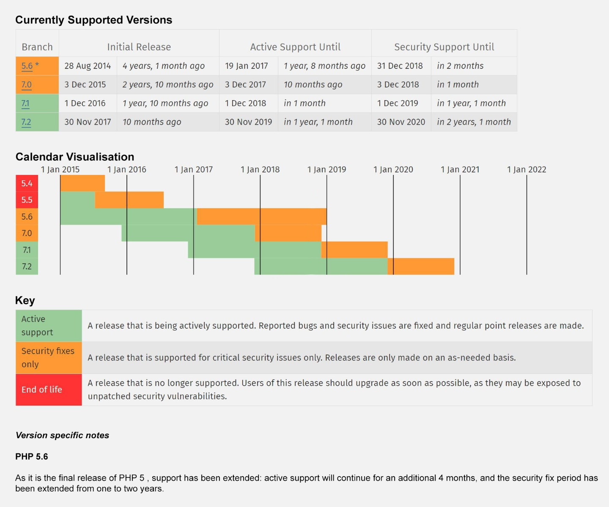
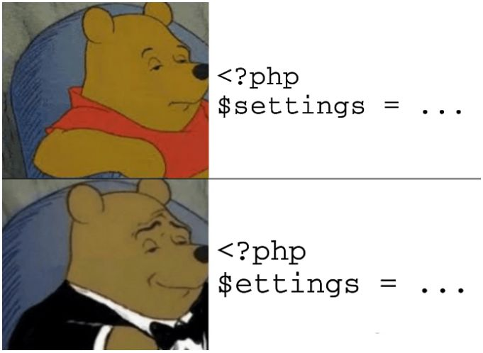

## PHP


[Дмитрий Вайнер](https://github.com/dmitryweiner)
---

### Идея
* PHP &mdash; рекурсивный акроним словосочетания PHP: Hypertext Preprocessor.
* Серверный интерпретатор (по типу Node.js).
* Создан 8 июня 1995.
* Текущая версия 8.0.
---


---


---

### Распространённые фреймворки
* [Symfony](https://symfony.com/).
* [Laravel](https://laravel.ru/).
* [Zend](https://framework.zend.com/).
* [Yii2](https://www.yiiframework.com/).
---

### Системы менеджмента контента (CMS)
* [Drupal](https://www.drupal.org/).
* [Wordpress](https://wordpress.com/ru/create/).
* [Joomla](https://joomla.ru/).
* [Magento](https://magento.com/).
---

### Система управления зависимостями
* [Composer](https://packagist.org/)
```shell
curl -sS https://getcomposer.org/installer | php
```
* Зависимости хранятся в composer.json:
```json
{
    "name": "your-vendor-name/package-name",
    "description": "A short description of what your package does",
    "require": {
        "php": ">=7.4",
        "another-vendor/package": "1.*"
    }
}
```
---

### Установка
* Windows:
  * [OpenServer](https://ospanel.io/).
  * [Denwer](http://www.denwer.ru/).
* Linux:
```shell
sudo apt install php # ставит v7.4
```
---

### Хостинг
* [Поисковик по хостингам](https://ru.hostadvice.com/hosting-services/free-php-hosting/).
* [000webhost.com](https://www.000webhost.com/).
---

### Базовый синтаксис
* [PHP-теги](https://www.php.net/manual/ru/language.basic-syntax.phptags.php):
```php
<?php /* всё, что в этих тегах, интерпретируется, как PHP-код */ ?>
```
  * Тег ?&gt; можно не закрывать, если файл содержит только код PHP.
* Создание переменных:
```php
<?php
$a = 1;
$b = $a + 1;
```
* Вывод:
```php
<?php
echo 123;
print_r([1]); // аналог console.log
```
---


---

### var_dump
* Если надо вывести тип, используется [var_dump()](https://www.php.net/manual/ru/function.var-dump.php):
```php
<?php
$a = [1, 2, 3];
var_dump($a);
```
* Выведет:
```
array(3) { [0]=> int(1) [1]=> int(2) [2]=> int(3) } 
```
---

### Укороченный вывод
* Вместо echo можно использовать короткий синтаксис "&lt;?=":
```php
<?php
  $a = "123";
?>
<?=$a?>
```
* Выведет:
```
123
```
---

### Типы данных

---

### Определение типа переменной
gettype 
---

### Операторы

---

### Массивы

---

### Ассоциативные массивы

---

### Приведение типов
* Строки

---

### Импорты

---

### Функции

---

### Классы

---

### Подключение к БД

---

### Изменение данных в БД

---

### 

---

### 

---

### 

---

### 

---

### 

---

### 

---

### 

---

### 

---

### 

---

### 

---

### 

---

### 

---

### 

---

### 

---

### 

---

### 

---

### 

---

### 

---

### 

---

### 

---

### 

---

### 

---

### Полезные ссылки
* https://www.php.net/manual/ru/tutorial.php
* http://ru.html.net/tutorials/php/
* https://getjump.github.io/ru-php-the-right-way/
* https://addphp.ru/
* https://proglib.io/p/samouchitel-dlya-nachinayushchih-kak-osvoit-php-s-nulya-za-30-minut-2021-02-08
* https://php.zone/kurs-php-dlya-nachinayushih

