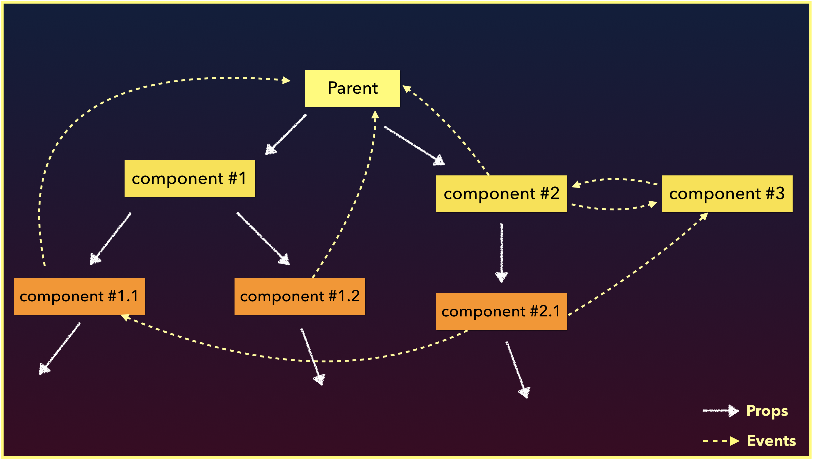
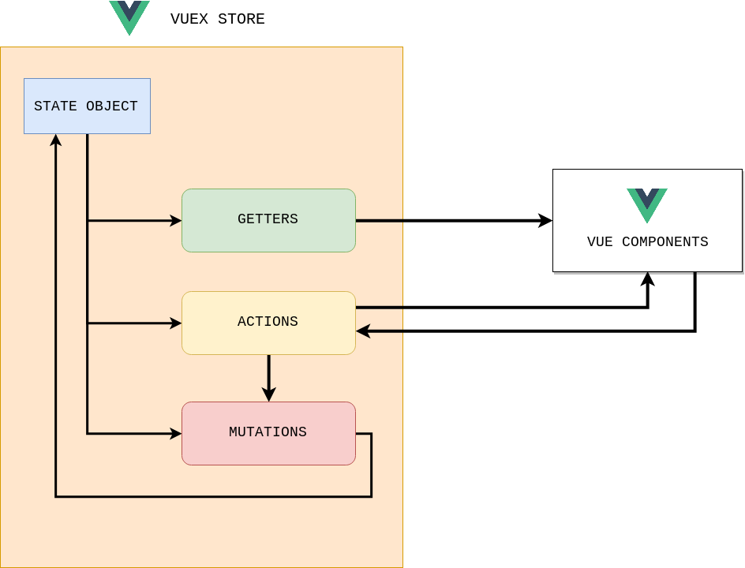
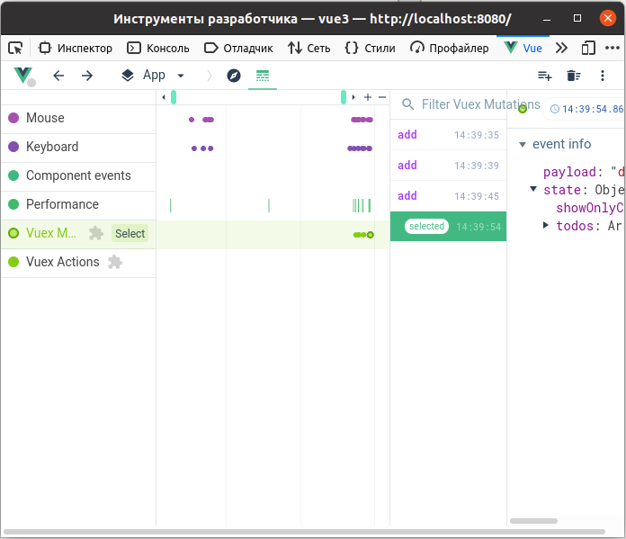

## VueX &mdash; менеджер состояний


[Дмитрий Вайнер](https://github.com/dmitryweiner)

[видео](https://drive.google.com/file/d/1enXUrW7qPL87YnnMUP9lWIkpBzscKxlS/view?usp=sharing)

---

### Проблематика


---


---

### Установка
* [Документация](https://next.vuex.vuejs.org/guide/).
* Все указания относятся к VueX **4** и Vue **3**.

```shell
npm i vuex
```

```js
import { createApp } from 'vue'
import { createStore } from 'vuex'

const store = createStore({
    state () {
      return { /* initial state */ }
    },
    mutations: { /* */ },
    actions: { /* */ },
    getters: { /* */ },
});

const app = createApp({ /* your root component */ });

// Install the store instance as a plugin
app.use(store);
```
---

### При создании проекта
* Можно выбрать опцию VueX при создании проекта, тогда всё поставится само:


---

### Подключение
* После ```app.use(store);``` у каждого компонента появляется объект ```this.$store```.
* Через этот объект можно взаимодействовать со стором:
  * Получать актуальное состояние.
  * Изменять его.
---

### Метод state
* Метод должен возвращать начальное состояние стора:
```js
state () {
      return {
          todos: [
              { id: 1, title: "Погладить кошку", isDone: true },
              { id: 2, title: "Почистить картошку", isDone: false }
          ]
      }
},
```
---

### Getters
* Геттеры &mdash; методы, калькулирующие данные по текущему состоянию стора.
* Очень похожи на computed методы в компонентах Vue.
* Будут пересчитываться только при изменении стора, когда выйдет Vue 3.1 ([issue](https://github.com/vuejs/vuex/issues/1878)).
```js
getters: {
    doneTodosCount(state) {
      return state.todos.filter(todo => todo.isDone).length;
    }
}
```
---

### Getters: аргументы
* Метод геттера получает на вход следующие аргументы:

```js
state,       // при использовании модулей — локальный state модуля
getters,     // локальные геттеры текущего модуля
rootState,   // глобальный state
rootGetters  // все геттеры
```
---

### Getters
* Доступ в компоненте:

```vue
computed: {
      doneTodosCount () {
        return this.$store.getters.doneTodosCount;
      }
}
```
---

### Связь Getters с computed
* Чтобы не писать для каждого геттера свойство в computed, можно использовать mapGetters:
```js
import { mapGetters } from 'vuex'
export default {
      // ...
      computed: {
        // mix the getters into computed with object spread operator
        ...mapGetters([
          'doneTodosCount',
          'anotherGetter',
          // ...
        ])
      }
}
```
---

### Mutations
* Мутации &mdash; методы, **синхронно** изменяющие стор:
```js
mutations: {
    add (state, payload) {
      const newTodo = {
        id: Math.random().toString(36).substr(2),
        title: payload,
        isDone: false
      }
      state.todos.push(newTodo);
    }
}
```
* Вызов в компоненте:
```vue
methods: {
      add() {
        this.$store.commit("add", "Полить цветы");
      }
},
```
---

### Mutations
* Мутации изменяют объект state.
* [Его не надо пересоздавать, как в Redux](https://gist.github.com/DawidMyslak/2b046cca5959427e8fb5c1da45ef7748).
Это происходит автоматически под капотом.
* При изменении стейта обновятся геттеры.
---

### Подключение мутаций к methods
* Чтобы не писать для каждой мутации метод в methods, можно использовать mapMutations:

```vue
import { mapMutations } from 'vuex';

export default {
  // ...
  methods: {
    ...mapMutations([
      'add', /* map `this.add()` to `this.$store.commit('add')` */
    ])
  }
}
```
---

### Actions
* Экшены не изменяют стейт сами, они для этого вызывают мутации.
* Экшены бывают асинхронные.
* Экшены могут вызывать экшены (саги, привет!).
```js
actions: {
    add({ commit, state, dispatch }, payload) {
        commit("add", payload);
    }
}
```
---

### Actions: первый аргумент
* На вход экшену приходит объект со следующими полями:
  * **commit**: метод для вызова мутации.
  * **state**: текущее состояние стора.
  * **dispatch**: метод для вызова другого экшена.
  * **rootState**: текущее состояние всего стора (если разделён на модули).
  * **getters**: геттеры.
  * **rootGetters**: геттеры всего стора.
---

### Actions: вызов в компоненте
* Экшен вызывается с помощью метода $store.dispatch:

```vue
methods: {
      add() {
        this.$store.dispatch("add", "Полить цветы");
      }
},
```
* Чтобы не писать обёртки, можно использовать mapActions:

```js
import { mapActions } from 'vuex'

export default {
      methods: {
        ...mapActions([
          'add', // map `this.add()` to `this.$store.dispatch('add')`
        ]),
      }
}

```
---


---

### Асинхронные экшены
* Экшены обычно бывают асинхронные.
* Чтобы не писать ```.then().catch()```, надо использовать синтаксический сахар async/await:
```js
actions: {
      async actionA ({ commit }) {
        commit('gotData', await api.getData());
      },
      async actionB ({ dispatch, commit }) {
        await dispatch('actionA') // wait for `actionA` to finish
        commit('gotOtherData', await api.getOtherData());
      }
}
```
---

### VueX и формы
* Очень часто возникает необходимость в поле ввода, связанном со стором.
* Текущее значение поля берётся с помощью геттера.
* При изменении поля вызывается мутатор.

---

### VueX и формы
```vue
// Form.vue
<template>
  <input type="text" :value="value" @change="onValueChanged">
</template>
<script>
export default {
    name: "Form",
    computed: {
      value() {
        return this.$store.getters.value;
      }
    },
    methods: {
      onValueChanged(e) {
        this.$store.commit("setValue", e.target.value);
      }
    }
}
</script>
```
----
```js
// store.js
const store = createStore({
  state () {
    return { value: "" }
  },
  mutations: { 
      setValue(state, payload) {
          state.value = payload;
      }
  },
  getters: { 
      value(state) {
          return state.value;
      }
  },
});
```
---

### VueX и формы
* Однако, разумнее работу с формой возложить на get/set внутри computed:

```vue
<input type="text" v-model="value"/>
computed: {
    value: {
        get() {
          return this.$store.getters.value;
        },
        set(value) {
          this.$store.commit('setValue', value);
        }
    }
}
```

* [Подробнее](https://vuex.vuejs.org/ru/guide/forms.html#%D0%B4%D0%B2%D1%83%D0%BD%D0%B0%D0%BF%D1%80%D0%B0%D0%B2%D0%BB%D0%B5%D0%BD%D0%BD%D1%8B%D0%B5-%D0%B2%D1%8B%D1%87%D0%B8%D1%81%D0%BB%D1%8F%D0%B5%D0%BC%D1%8B%D0%B5-%D1%81%D0%B2%D0%BE%D0%B8%D1%81%D1%82%D0%B2%D0%B0).
---

### Несколько модулей
* Желательно разделить стор на несколько модулей по числу сущностей.
* Это делается для облегчения стора и ясной кодовой базы.
* Также это делается, чтобы компоненты не обновлялись от чужих изменений.
* [Документация](https://next.vuex.vuejs.org/guide/modules.html).
---

### Модули

```js
const moduleA = {
  state: () => ({ ... }),
  mutations: { ... },
  actions: { ... },
  getters: { ... }
}

const moduleB = {
  state: () => ({ ... }),
  mutations: { ... },
  actions: { ... }
}

const store = createStore({
  modules: {
    a: moduleA,
    b: moduleB
  }
})

store.state.a // -> `moduleA`'s state
store.state.b // -> `moduleB`'s state
```
---

### Модули
* В экшене есть доступ к корневому стейту **rootState**, если нужны данные из других модулей.
* rootState передаётся как один из параметров экшена:
```js
const moduleA = {
      // ...
      actions: {
        incrementIfOddOnRootSum ({ state, commit, rootState }) {
          if ((state.count + rootState.count) % 2 === 1) {
            commit('increment')
          }
        }
      }
}
```
---

### Модули и пространство имён
* Если у модуля задать параметр ```namespaced: true```, экшены и геттеры надо будет вызывать с именем модуля.
* Это удобнее, т.к. названия методов могут перекрываться.
---

### Модули и пространство имён
```js
moduleA = {
  actions:{
    save(){}
  },
  namespaced: true
}

moduleB = {
  actions:{  
    save(){}
  },
  namespaced: true
}
//
this.$store.dispatch('moduleA/save')
this.$store.dispatch('moduleB/save')
```
---

### Работа с TypeScript

[Документация](https://next.vuex.vuejs.org/guide/typescript-support.html)

```ts
import { ActionTree, GetterTree, MutationTree } from "vuex";
import { RootState } from "@/store/type";

type StateType = {
  list: Array<string>;
};

const state: StateType = {
  list: [],
};

const mutations: MutationTree<StateType> = {
  ADD_TODO: (state, item: string): void => {
    state.list.push(item);
  },
};

const getters: GetterTree<StateType, RootState> = {
  list: (state): Array<string> => state.list,
};

const actions: ActionTree<StateType, RootState> = {
  async addTodo({ commit }, data: string) {
    commit("ADD_TODO", data);
  },
};

export default {
  namespace: true,
  state,
  mutations,
  getters,
  actions,
};
```
---

### Тестирование
* Getters, mutations выносятся в отдельные объекты и тестируются отдельно.
* Для тестирования экшенов используется inject-loader.
* [Документация](https://next.vue-test-utils.vuejs.org/guide/advanced/vuex.html).
* [Хорошее руководство по тестированию](https://lmiller1990.github.io/vue-testing-handbook/testing-vuex.html#testing-vuex).
---

### Тест формы
Проверка, вызывает ли компонент нужную мутацию (стор не настоящий):
```js
it("calls 'add' mutation with argument", () => {
  const title = "title";
  const $store = {
    state: {
    },
    commit: jest.fn()
  };
  const wrapper = shallowMount(AddTodoForm, {
    global: {
      mocks: {
        $store
      }
    }
  });
  const input = wrapper.find('input');
  input.element.value = title;
  input.trigger('input')
  const form = wrapper.find('form');
  form.trigger('submit');
  expect($store.commit).toBeCalledWith("add", title);
});
```
---

### Тест компонента
Проверка с созданием настоящего стора (внимание на global.plugins):
```js
it("shows filtered list of items", () => {
  const store = createStore({
    state: {
      todos: [
        {"id":"hwnswwcdkje","title":"a","isChecked":false},
        {"id":"kt2ib5xuk2f","title":"b","isChecked":false},
        {"id":"1qp1s4fynd8","title":"d","isChecked":true},
        {"id":"ula2j239e1","title":"dddd","isChecked":false},
        {"id":"cvi2s2o5b3","title":"вавыфа","isChecked":false},
        {"id":"66a4j73i6fv","title":"sadfsdfasdfasdf","isChecked":true}
      ],
      showOnlyChecked: true
    },
    getters
  });
  const wrapper = mount(List, {
    global: {
      plugins: [store]
    }
  });
  const items = wrapper.findAll('.list-item');
  expect(items.length).toBe(2);
});
```
---

### Тест мутации
```js
it("deletes item by id", () => {
  const title = "new element";
  const store = createStore({
    state: {
      ...initialState
    },
    mutations
  })
  store.commit("add", title);
  const id = store.state.todos[0].id;
  store.commit("delete", id);
  expect(store.state.todos.length).toBe(0);
});
```
---

### Тест экшена
```js
const response = {
    "id": 6175334,
    /* ... */
};

describe('store.js', () => {
    it('проверка экшена load', async () => {
        fetch.mockResponseOnce(JSON.stringify(response));
        const store = createStore(storeConfig);
        await store.dispatch('load', 'test');
        expect(store.state.result).toHaveProperty('id');
        expect(store.state.result.id).toBe(response.id);
    })
})
```
----

### Экшен в сторе
```js
import { createStore } from 'vuex'

export const storeConfig = {
  state() {
    return {
      result: undefined,
      isLoading: false
    };
  },
  mutations: {
    setResult(state, payload) {
      state.result = payload;
    },
    setIsLoading(state, payload) {
      state.isLoading = payload;
    }

  },
  actions: {
    async load({commit}, payload) {
      commit('setIsLoading', true);
      const res = await fetch(`https://api.github.com/users/${payload}`);
      const json = await res.json();
      commit('setResult', json);
      commit('setIsLoading', false);
    }
  },
};

export default createStore(storeConfig);
```
---

### Отладка
* Если поставить отладочное расширение для
  [Google Chrome](https://chrome.google.com/webstore/detail/vuejs-devtools/ljjemllljcmogpfapbkkighbhhppjdbg)
  или [FireFox](https://github.com/vuejs/devtools/releases/tag/v6.0.0-beta.15).
* Можно смотреть состояние стора и происходящие мутации и экшены.
---

### Отладка

---

### Отладка

---

### Альтернативы: pinia
* VueX довольно сложно типизировать, поэтому написали библиотеку [pinia](https://github.com/posva/pinia).

```js
import { defineStore } from 'pinia'

// main is the name of the store. It is unique across your application
// and will appear in devtools
export const useMainStore = defineStore('main', {
  // a function that returns a fresh state
  state: () => ({
    counter: 0,
    name: 'Eduardo',
  }),
  // optional getters
  getters: {
    doubleCount() {
      return this.counter * 2
    },
    // use getters in other getters
    doubleCountPlusOne() {
      return this.doubleCount * 2 + 1
    },
  },
  // optional actions
  actions: {
    reset() {
      // `this` is the store instance
      this.counter = 0
    },
  },
})
```
---

### Полезные ссылки
* https://next.vuex.vuejs.org/guide/ (для VueX 4)
* https://vuex.vuejs.org/ru/guide/ (для VueX 3)
* https://lmiller1990.github.io/vue-testing-handbook/
